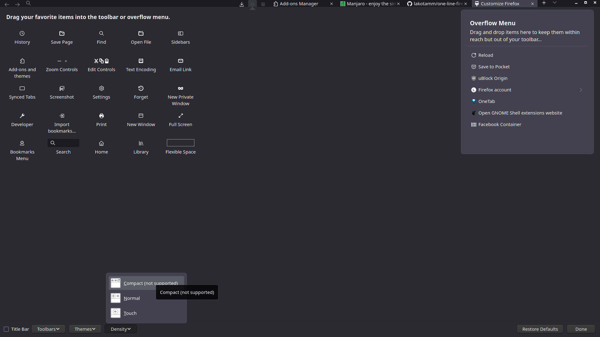

# One-line Firefox
A minimal one-liner, compatible with the latest Firefox 89 and the new Proton interface
## Screenshots

## Instructions

- Use with compact density, auto-hide downloads button, remove all flexible space and unnecessary items.

- In Firefox:
  - Open _`about:config`_ 
      - set `toolkit.legacyUserProfileCustomizations.stylesheets` to `true`
      - set `browser.compactmode.show` to `true` (allows you to enable compact mode)
  - Restart Firefox and enable Compact mode in the **Customize Toolbar** menu
  - Open _`about:support`_, click on **Open Folder**.

- Create a sub-folder named `chrome`.

- Put this [`userChrome.css`](https://raw.githubusercontent.com/lakotamm/one-line-firefox/master/userChrome.css) into that folder (you can download this file by right-click and select _Save link as..._).

- Restart Firefox

## Known bugs
The Tab bar is moved to the right by 5% when the window is floating (not attached to a side, neither maximized). If you have any ideas for fix, please let me know.

## Credits
Forked from khuedoan98 https://github.com/khuedoan98/one-line-firefox
Based on original layout by /u/Herkt and /u/bleeps__:

https://www.reddit.com/r/FirefoxCSS/comments/7eazix/my_attempt_at_a_oneline_interface/

https://www.reddit.com/r/FirefoxCSS/comments/7ignsk/oneline_flat_interface_dark_light/
